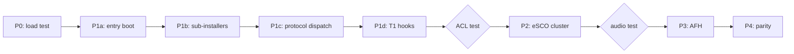

# Libre Patch Architecture — Master Design Document

**Date**: 2026-06-09  
**Status**: Phase 5 complete — authoritative architecture reference for Phase 6 implementation  
**Audience**: Implementers of `rtl8761bu-libre/` MIPS16e assembly/C sources

This document synthesizes all Phase 5 design artifacts into a single architecture
view: what the libre firmware is, how it fits into the chip and kernel, how code
is organized, and how to grow from a load-only skeleton to full reference parity.

**Companion specifications** (detail lives there; this doc links and integrates):

| Document | Scope |
|----------|-------|
| `reverse_engineering_libre_patch_layout.md` | EPatch envelope, PRAM map, linker sections |
| `reverse_engineering_mandatory_hooks.md` | Per-slot verdicts, profiles P0–P4 |
| `reverse_engineering_stub_implementations.md` | SHIM/STUB patterns, source tree, Makefile profiles |
| `reverse_engineering_minimum_feature_set.md` | T0–T4 tier definitions, size estimates |
| `reverse_engineering_config_blob.md` | `rtl8761bu_config.bin`, BD_ADDR TLV |
| `reverse_engineering_patch_installer.md` | `FUN_8010a000` boot sequence, hook map Appendix D |

---

## 1. Architectural overview

### 1.1 Problem statement

The RTL8761BU USB dongle (UB500) ships with a proprietary 42 KiB firmware patch
(`rtl8761bu_fw.bin`) that the Linux `btrtl` driver loads at boot via HCI VSC
`0xFC20`. The patch is **not** a standalone Bluetooth stack — it is a MIPS16e
runtime overlay that:

1. Runs once at boot from ROM entry `0x8010A001`
2. Writes function pointers into ROM-allocated DRAM hook slots
3. Returns control to the silicon ROM, which continues running the full BT stack

The libre replacement must reproduce enough of this overlay to make the ROM stack
functional, using **only source code** (no embedded binary blobs), suitable for
linux-libre inclusion.

### 1.2 Design principle: ROM owns the stack, patch owns the hooks

```
┌─────────────────────────────────────────────────────────────────┐
│  Linux kernel (btrtl)                                           │
│    FC20 download → rtl8761bu_fw.bin + rtl8761bu_config.bin      │
└────────────────────────────┬────────────────────────────────────┘
                             │
┌────────────────────────────▼────────────────────────────────────┐
│  Chip silicon ROM  (0x80000000+)                                │
│    • Full BT 5.1 stack (HCI, LMP, LC, pairing, …)               │
│    • Allocates bos_base, config_base, DRAM hook slots             │
│    • Calls patch_entry @ 0x8010A001 once at init                │
│    • Dispatches through DRAM fn-ptr slots thereafter            │
└────────────────────────────┬────────────────────────────────────┘
                             │ jalr 0x8010A001
┌────────────────────────────▼────────────────────────────────────┐
│  Libre patch PRAM  (0x8010A000 – 0x8010A41F, 27,808 B)          │
│    patch_entry: BSS init → sub-installers → hook installs →     │
│                 BD_ADDR sync → RF init → patch_active = 4         │
│    Hook handlers: protocol dispatch, ACL scheduler, eSCO, AFH…   │
└─────────────────────────────────────────────────────────────────┘
```

**Never reimplement** what ROM already provides (HCI command handling, 73 VSC
opcodes, LMP state machines, codec templates, per-connection HW JIT). **Always
call** ROM at fixed `0x8000xxxx` addresses via `jalr` or tail-call shims.

### 1.3 What the reference patch does (and libre must match)

The authoritative runtime entry is `FUN_8010a000` (578 B), **not** the older
`FUN_80103780` master installer in the vanilla binary's first patch section.
`FUN_8010a000` is a monolithic installer that:

| Phase | Action |
|-------|--------|
| Pre-init | Config word split; BSS zero (`0x80109C00`, 1 KiB) |
| Infrastructure | 6 sub-installers → RAM fn-ptr tables |
| Hooks | 44 DRAM slot writes + 6 `bos_base` struct slots |
| Silicon | Revision detect, TLV applier, BD_ADDR copy, HW probe |
| RF | BB regs 0x114/0x154 (gated), RF channel init (7 tables) |
| Finalize | ROM register script; `*0x80120538 = 4` (patch active) |

Libre `patch_entry` must follow this order. See §5 for the phased implementation
mapping.

---

## 2. Memory architecture

### 2.1 Address spaces

| Region | Runtime range | Owner | Libre action |
|--------|---------------|-------|--------------|
| ROM | `0x80000000–0x8007FFFF` | Silicon | Call only; never embed |
| Patch PRAM | `0x8010A000–0x8010A41F` | Patch binary | Code + rodata |
| Patch BSS | `0x80109C00–0x80109FFF` | Zeroed at boot | `memset` via ROM |
| DRAM hooks | `0x80120000–0x80133FFF` | ROM allocates | Write fn-ptrs only |
| `config_base` | ≈`0x80120070` | ROM-init | Read; TLV optional |
| `bos_base` | ≈`0x801206AC` | ROM-allocated | Install 6 struct hooks |
| MMIO | `0xB000xxxx` / `0xB600xxxx` | Hardware | Via ROM r/w fns or direct |

### 2.2 On-disk envelope (EPatch v2)

Libre ships a **single-patch** image (27,928 bytes total):

- 9-byte magic `Realtechk` (not 8-byte `Realtech`)
- `chip_id = 2` (UB500: `rom_version + 1`)
- 27,808-byte PRAM body @ file offset `0x30`
- 72-byte extension trailer (`0x77FD0451` magic)

Config is a **separate** 6-byte file (`rtl8761bu_config.bin`) appended by the
driver to the final FC20 chunk — not embedded in `.fw.bin`.

Full field layout: `reverse_engineering_libre_patch_layout.md` §2.

### 2.3 PRAM linker model

```ld
MEMORY { pram (rwx) : ORIGIN = 0x8010A000, LENGTH = 27808 }
SECTIONS {
    .text.entry  : { KEEP(*(.text.entry)) }   /* patch_entry first */
    .text.hooks  : { *(.text.hooks) *(.text.*) }
    .rodata      : { *(.rodata.*) }            /* literal pools, RF tables */
}
```

- **Entry** at `0x8010A000` (ROM calls odd addr `0x8010A001`)
- **Footer** at PRAM+`0x6C9C`: `0x09A95FD1` (applied by `pad.py`)
- **NOP fill**: MIPS16e NOP `0x6500` between code end and footer

**Load-base caveat**: Reference patch 1 loads at `0x80103780`; entry lands at
`0x8010A000` via offset arithmetic. Current linker places entry at PRAM base
directly. Hardware test required; if FC20 fails, switch to load-base `0x80103780`
with `0x6880` bytes NOP padding before entry.

---

## 3. Component architecture

### 3.1 Layer model

```
┌──────────────────────────────────────────────────────────────┐
│ L4  Feature handlers   eSCO, AFH, coexistence (T2–T3)       │
├──────────────────────────────────────────────────────────────┤
│ L3  Protocol dispatch  LMP/HCI/LC interceptors (T1)          │
├──────────────────────────────────────────────────────────────┤
│ L2  Hook installers    44 DRAM writes + bos_base slots (T1)  │
├──────────────────────────────────────────────────────────────┤
│ L1  Sub-installers     6 infrastructure functions (T1)       │
├──────────────────────────────────────────────────────────────┤
│ L0  Boot / entry       BSS, silicon detect, RF init (T1)     │
└──────────────────────────────────────────────────────────────┘
         All layers call down to ROM (T0) — never up
```

### 3.2 Entry boot component (`patch_entry`)

Replaces `FUN_8010a000`. Composed of:

| Submodule | Reference fn | Size | Tier |
|-----------|-------------|------|------|
| BSS zero | `FUN_8010a6c8` | 24 B | T1 |
| Sub-installers 1–6 | `af40`…`eac0` | 8–112 B each | T1 |
| Hook install table | inline in entry | — | T1–T4 |
| Silicon rev | `FUN_8010e214` | 96 B | T1 |
| TLV applier | `FUN_8010a7b8` | 114 B | T1 (no-op OK) |
| BD_ADDR | ROM `0x8000FD38` | — | T1 |
| HW probe + BB init | `ad38` + `b04c` | 138 B | T1 |
| RF channel init | `FUN_8010c278` | 394 B | T1 |
| Reg script | ROM `0x8003AEA0` | — | T1 |
| Active sentinel | `*0x80120538 = 4` | — | T1 |

Current `src/init.S` is a **P0 skeleton** (25 ROM calls, no hook installs).
Phase 6 replaces it with the full boot sequence above.

### 3.3 Sub-installer component

Six functions called early in `patch_entry`. All **T1 mandatory**:

| # | Function | Effect |
|---|----------|--------|
| 1 | `FUN_8010af40` | Clear bit 6 of BB reg `0x108` |
| 2 | `FUN_8011011c` | Install 19 fn-ptrs → `0x801205B0–0x80121100` |
| 3 | `FUN_8010fc58` | 1 fn-ptr + callee |
| 4 | `FUN_8010f370` | 10 data-ptrs into 28-byte struct |
| 5 | `FUN_8010e81c` | 1 fn-ptr |
| 6 | `FUN_8010eac0` | Write `0xFFFFFFFF` sentinel + call |

Sub-installer #2's 19 targets are unanalyzed (T4 concern); the installer itself
must run verbatim for P1.

### 3.4 Hook install component

Two hook namespaces:

**A. DRAM slots** (44 installs from `FUN_8010a000`):

Written as `*(uint32_t *)slot = handler_addr | 1` (MIPS16e interwork bit).

Roll-up by tier:

| Tier | Count | Profile |
|------|-------|---------|
| T1 | 22 | P1 minimal BT |
| T2 | 14 | P2 eSCO audio |
| T3 | 7 | P3 AFH |
| T4 | 1 | P4 full parity |

Full table: `reverse_engineering_mandatory_hooks.md` §4.

**B. `bos_base` struct slots** (6 fields in BT operational state):

| Offset | Handler | Verdict |
|--------|---------|---------|
| `+0x20` | `LAB_8010c1e8` | IMPL-T1 |
| `+0x24` | `LAB_8010c224` | IMPL-T1 |
| `+0x30` | `LAB_8010c088` | SHIM-T1 (16 B ROM tail-call) |
| `+0x1c` | `LAB_8010bc74` | IMPL-T1 |
| `+0x50` | `LAB_8010f884` | IMPL-T2 |
| `+0xd8` | `LAB_8010bba4` | IMPL-T2 / NULL-T1 for ACL-only |

**C. Global RAM hooks — never install**:

| Slot | Verdict |
|------|---------|
| `0x801212e4` | ROM-NULL (HW write path) |
| `0x801212e0` | ROM-NULL (conn-type override) |
| `crypto_struct+0xe4` | ROM-managed (SSP JIT code) |

### 3.5 Protocol dispatch component

Installed by `FUN_8010e27c` into struct @ `0x8012AE8C` (not a `bos_base` offset):

```
                    ┌─────────────────┐
  ROM messages ───► │ FUN_8010e27c    │ installer (52 B)
                    └────────┬────────┘
                             │ writes 6 handler ptrs
         ┌───────────────────┼───────────────────┐
         ▼                   ▼                   ▼
   FUN_8010dfb0        FUN_8010daa4        FUN_8010cc94
   LMP intercept       HCI events          sequencer:
   (SSP, eSCO)         (inquiry, conn)     ROM then patch
         │                   │                   │
         ▼                   ▼                   ▼
   tail-call ROM       tail-call ROM       FUN_8010ca20
   0x80071634          0x80020bec          (type 0x67 monitor)
```

| Handler | P1 action | P2+ action |
|---------|-----------|------------|
| `dfb0` | IMPL | IMPL |
| `daa4` | IMPL | IMPL |
| `cc94` | IMPL (26 B, both calls) | IMPL |
| `d154` | SHIM → ROM `0x80066E68` | SHIM |
| `da70` | SHIM → ROM `0x80042420` | IMPL (eSCO TX intercept) |
| `d9f4` | SHIM → ROM `0x80042188` | IMPL (eSCO RX intercept) |
| `ca20` | STUB (empty return) | STUB → IMPL at P3 |

### 3.6 Config / BD_ADDR component

Two-stage config path:

1. **Kernel** → FC20 download appends `rtl8761bu_config.bin`
2. **ROM** stores blob; `FUN_8010a7b8` applies TLV records to `config_base`
3. **ROM** `copies_config_bdaddr` (`0x8000FD38`) syncs `config_base+0x30` → global BD_ADDR

Libre default: 6-byte header-only config (`remaining = 0` → TLV loop is no-op).
BD_ADDR override via `gen_config.py --bdaddr XX:XX:…`.

Details: `reverse_engineering_config_blob.md`.

---

## 4. Build system architecture

### 4.1 Pipeline

```
src/*.[cS]  ──► mipsel-linux-gnu-gcc  ──► build/patch.elf
build/patch.elf  ──► objcopy  ──► build/patch.bin
build/patch.bin  ──► pad.py (NOP + footer)  ──► build/patch_padded.bin
build/patch_padded.bin  ──► pack.py  ──► rtl8761bu_fw.bin
gen_config.py  ──► rtl8761bu_config.bin
```

### 4.2 Source tree (target layout)

```
rtl8761bu-libre/
  src/
    init.S              # patch_entry — boot sequence + hook install calls
    stub_macros.S       # SHIM-DIRECT, SHIM-POOL, LOAD_ADDR macros
    install/
      hooks.S           # write_hook() helpers, install table by profile
      sub_installers.S  # 6 sub-installer functions
    shims/
      shim_d154.S       # LMP_CH passthrough (16 B)
      shim_c088.S       # bos+0x30 conn handler (16 B)
      shim_da70_t1.S    # LC TX P1 passthrough
      shim_d9f4_t1.S    # LC RX P1 passthrough
      stub_ca20_t1.S    # type 0x67 empty handler
    trivial/
      fn_a49c.S         # flag clear (10 B)
      fn_a594.S         # MMIO write (14 B)
    hooks/              # full IMPL functions (one file per fn or group)
      fn_b118.S         # slot interval allocator
      fn_b3d8.S         # ACL slot scheduler
      …
    rodata/
      rf_tables.S       # 7 RF register tables (verbatim constants)
      chip_rev_table.S  # PTR_DAT_8010a3a0
  rtl8761bu.ld
  Makefile              # PROFILE=P0|P1|P2|P3 selects object set
  pack.py               # fix: 9-byte "Realtechk" magic
  pad.py
  gen_config.py
```

### 4.3 Profile builds

Makefile `PROFILE` variable gates which objects link and which hook installs
`patch_entry` executes:

| Profile | Goal | Hook policy | Est. PRAM |
|---------|------|-------------|-----------|
| **P0** | Patch loads, `*0x80120538 = 4` | Entry + sub-installers; most hooks NULL | < 1 KiB |
| **P1** | `hciconfig up`, scan, ACL | P0 + 22 T1 hooks + shims + protocol core | ~5–7 KiB |
| **P2** | SCO/eSCO audio | P1 + 14 T2 hooks + `bos+0xd8` gateway | ~11–13 KiB |
| **P3** | AFH / Wi-Fi coexistence | P2 + 7 T3 hooks + full `ca20` | ~14–17 KiB |
| **P4** | Reference parity | All 44 hooks + sub-installer #2 targets | ≤ 27,808 B |

**OMIT-INSTALL** (skip the store) is preferred over installing dummy fn-ptrs for
tier-gated hooks — NULL lets ROM fall back safely.

Stub contribution is ~150 B total (negligible vs IMPL code).

### 4.4 MIPS16e coding conventions

| Rule | Detail |
|------|--------|
| Fn-ptr install | Always OR address with 1 (interwork bit) |
| ROM tail-call | Target addr also odd (`0x80042421` → fn at `0x80042420`) |
| Literal pools | PC-relative `lw`; place within ±32 KiB of consumer |
| 32-bit MMIO stores | 4× `sb` sequence (unaligned peripheral workaround) |
| Stack / `ra` | Standard epilogue: `lw a3,offset(sp); jr a3` + delay-slot `addiu sp` |
| Cross-ISA entry | ROM uses JALX to `0x8010A001`; entry in `.set mips16` |

---

## 5. Implementation roadmap (Phase 6)

### 5.1 Recommended sequence



| Step | Work item | WIP phase | Deliverable |
|------|-----------|-----------|-------------|
| 1 | Fix `pack.py` 9-byte magic | 6 | `make verify` passes |
| 2 | Rewrite `patch_entry` boot sequence | 6 | P0 loads on UB500 |
| 3 | Implement 6 sub-installers | 6 | Infrastructure tables populated |
| 4 | Protocol dispatch (`e27c` + core) | 6 | Inquiry/conn events handled |
| 5 | T1 DRAM hooks + bos shims | 6 | P1: scan + ACL |
| 6 | Decompile remaining T1-unknown hooks | 2 RE | May downgrade some T1 items |
| 7 | LMP VSC gateway + eSCO cluster | 6 | P2: headset audio |
| 8 | AFH engine | 6 | P3: Wi-Fi coexistence |
| 9 | Sub-installer #2 targets + T4 remainder | 6 | P4 parity |

### 5.2 Current state vs target

| Component | Current (`init.S`) | Target |
|-----------|-------------------|--------|
| Entry | 25 legacy ROM calls | Full `FUN_8010a000` sequence |
| Hook installs | None | Profile-gated 0–44 stores |
| Sub-installers | None | All 6 |
| Protocol dispatch | None | `e27c` + 7 handlers |
| `pack.py` magic | 8-byte `Realtech` | 9-byte `Realtechk` |
| Config | 6-byte default | Same (BD_ADDR optional) |

### 5.3 Size budget and growth

| Tier | Est. instructions | PRAM bytes (×~3) | Fits 27,808 B? |
|------|-------------------|------------------|----------------|
| P1 (T1) | ~1,700–2,200 | ~5–7 KiB | Yes |
| P2 (+T2) | +~1,990 | +~6 KiB | Likely yes |
| P3 (+T3) | +~1,100 | +~3 KiB | Borderline |
| P4 (full) | +~3,000+ | +~9 KiB+ | May need two-patch layout |

**Growth escape hatch**: If P3 exceeds 27,808 B, use two-patch EPatch envelope
(patch 0 @ `0x30` for §1 code, patch 1 @ `0x3780` for §2 entry) matching the
non-free dual-patch layout. Defer until `make size` proves necessary.

---

## 6. Verification architecture

### 6.1 Build-time checks

```bash
make verify   # EPatch header: Realtechk, chip_id=2, ext magic 0x77fd0451
make size     # code+rodata ≤ 27,804 B (4 B reserved for footer)
```

Objdump: `patch_entry` at `0x8010a000`. Last 4 PRAM bytes = `d1 5f a9 09`.

### 6.2 Hardware test matrix

| Test | Profile | Pass criterion |
|------|---------|----------------|
| FC20 load | P0 | `dmesg`: fw version `0x09a98a6b`; no timeout |
| Patch active | P0 | ROM accepts patch (`*0x80120538 == 4` behaviour) |
| HCI up | P1 | `hciconfig hci0 up` |
| Inquiry / scan | P1 | `hcitool scan` finds peers |
| ACL connect | P1 | L2CAP ping succeeds |
| ACL without `bos+0xd8` | P1 | Connect OK; eSCO VSC fails gracefully |
| SCO / eSCO audio | P2 | Bidirectional headset audio |
| AFH under Wi-Fi | P3 | Stable connection vs reference firmware |
| linux-libre policy | P1+ | No binary blobs; licence TBD |

### 6.3 Regression tooling

- Ghidra GZF process mode: decompile libre `patch.bin` loaded at `0x8010A000`
- Diff hook install table against Appendix D (`reverse_engineering_patch_installer.md`)
- `wairz` scripts: `DumpEntryLiteralPool.java`, `DecompileAddr.java`

---

## 7. Explicit non-goals

These are **100% ROM-managed** — libre firmware implements zero code:

| Item | Reason |
|------|--------|
| Global HW hook `0x801212e4` | NULL in reference; ROM clamp-only fallback |
| Per-conn `crypto_struct+0xe4` | ROM `FUN_80025b68` at SSP installs JIT code |
| Conn-type dispatch `FUN_80050810` | Types 0–3 pure ROM |
| Codec templates | ROM staging tables + un-scramble |
| 73 HCI VSC opcodes | ROM router `0x80030F1C` |
| LMP `0x25B/25C/266/271` | ROM stubs |
| `FUN_80103780` master installer | Parallel variant; not runtime entry |
| Address-pair table @ file `0xA0` | Purpose unresolved; DATA block zeros |
| Late-patch fns `80109980`…`80109824` | Outside 27,808 B PRAM window |

---

## 8. Risk register

| Risk | Impact | Mitigation |
|------|--------|------------|
| PRAM load base wrong (`0x8010A000` vs `0x80103780`) | FC20 timeout | Hardware test; dual layout in linker script |
| 20 T1-unanalyzed hooks are actually critical | ACL fails on P1 | Decompile before P1 sign-off; conservative install all |
| Sub-installer #2 targets on ACL path | P1 fails without them | Replicate installer verbatim; decompile 19 targets |
| P3 exceeds 27,808 B | Build failure | Two-patch envelope; or profile split |
| `pack.py` 8-byte magic | Driver rejects blob | Fix before first flash |
| `init.S` ROM addresses stale | P0 timeout | Cross-check against GZF `FUN_8010a000` decompile |

---

## 9. Summary

| Layer | Libre strategy |
|-------|----------------|
| **Envelope** | Single EPatch v2, `chip_id=2`, 27,808 B @ file `0x30` |
| **Entry** | Monolithic `patch_entry` = `FUN_8010a000` equivalent |
| **ROM** | Call at fixed addresses; SHIM tail-call for passthrough handlers |
| **Hooks** | Profile-gated installs; ROM-NULL globals never written |
| **Stubs** | ~150 B shims; OMIT-INSTALL for tier-gated hooks |
| **Config** | Separate 6-byte file; BD_ADDR via TLV when needed |
| **Growth** | P0 → P1 → P2 → P3 → P4 via Makefile `PROFILE` |
| **Testing** | Load → HCI → scan → ACL → eSCO → AFH progression |

Phase 6 begins with rewriting `patch_entry` and fixing `pack.py`. All function-level
detail, per-hook verdicts, and assembly patterns are in the companion documents
listed at the top of this file.
