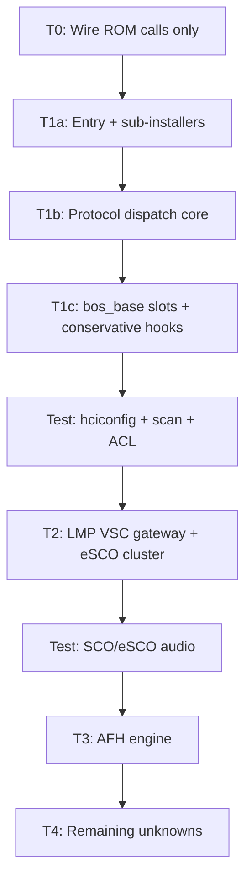

# Minimum vs Full Feature Set — Libre Implementation Classification

**Date**: 2026-06-09  
**Sources**: `FUN_8010a000` hook map (Appendix D), LMP/HCI VSC opcode map,
protocol dispatch layer, SCO/eSCO layer, hardware layer, sub-installer analysis.

This document answers: *what must the libre patch implement for basic Bluetooth
bring-up (inquiry, scan, ACL connect) versus full UB500 reference-firmware parity?*

---

## Tier definitions

| Tier | Name | Goal | Patch code |
|------|------|------|------------|
| **T0** | ROM-only | Handled entirely by chip ROM | Call fixed `0x8000xxxx` addresses; no reimplementation |
| **T1** | Minimal BT | `hciconfig up`, inquiry/scan, ACL connect, pairing | Entry installer + critical `bos_base` hooks + protocol dispatch core |
| **T2** | Audio / eSCO | SCO/eSCO links, headset profile | T1 + eSCO/SCO hook cluster + LMP VSC gateway |
| **T3** | AFH / coexistence | Adaptive frequency hopping, Wi-Fi/BLE coexistence | T2 + AFH engine cluster + type-0x67 monitor |
| **T4** | Full parity | Match reference `rtl8761bu_fw.bin` behaviour | All DATA-block PATCH functions + all 44 hook targets |

**Conservative rule**: Any function installed by `FUN_8010a000` into a `bos_base`
slot (`+0x1c`, `+0x20`, `+0x24`, `+0x30`, `+0x50`, `+0xd8`) is **T1 mandatory**
until decompiled and proven optional. Unanalyzed hook targets are listed as
**T1-conservative** with a decompile TODO.

---

## T0 — ROM-only (zero patch implementation)

These subsystems are invoked by address from the patch but never reimplemented.

| Subsystem | ROM entry / note | Reference |
|-----------|------------------|-----------|
| Patch download HCI VSC `0xFC20` | `VSC_0xfc20__download_patch` | Runs before patch is active |
| HCI OGF 0x3F router (73 VSC opcodes) | `0x80030f1c` | All handlers ROM |
| LMP VSC leaf `FUN_80047c50` | eSCO config PDU parser | Called via gateway pool |
| LMP opcodes `0x25B`, `0x25C`, `0x266`, `0x271` | ROM stubs + optional fptrs | Patch does not install fptrs |
| `copies_config_bdaddr` | `0x8000fd38` | Entry calls ROM directly |
| Register script interpreter | `FUN_8003aea0` `0x8003aea0` | Entry calls via fn-ptr |
| HW register read/write | `0x8001136c` / `0x8001139c` | Used by patch via fn-ptrs |
| Connection-type hw init chain | `FUN_80050810` + 4 handlers | Types 0–3 |
| eSCO packet-type / slot tables | `FUN_80044730`, `DAT_8007abb0`… | 100% ROM |
| Codec template un-scramble | `FUN_80025b68` | SSP path; installs `bos+0xe4` hook |
| HW-write hook at `0x801212e4` | ROM-generated MIPS16e at conn setup | Not in patch binary |
| All 6 protocol-dispatch **ROM originals** | `0x800138cc`, `0x80066e68`, `0x80042188`, `0x80042420`, `0x80020bec`, `0x80071634` | Tail-call targets |
| AFH ROM tail-calls from `FUN_8010ce0c` | `FUN_800117a4`, `FUN_8000c3f4`, `FUN_800122b8` | Fixed addresses |
| RAM fn-ptr slots `0x8012082c`, `0x80120958` | → `FUN_8004ce44`, `FUN_8005d364` | ROM populates or patch copies |

---

## T1 — Minimal BT (scan, connect, basic ACL)

### Entry-point boot sequence (all mandatory)

`FUN_8010a000` is the authoritative patch entry (`0x8010a001` odd). Every step
below must run (or equivalent pre-init) before the ROM treats the patch as active.

| Step | Function | Size | Notes |
|------|----------|------|-------|
| Config word copy | inline in entry | — | Splits 32-bit word to `config_base+0x60/62` |
| BSS zero | `FUN_8010a6c8` | 24 B | `memset(0x80109c00, 0, 0x400)` via ROM |
| Sub-installers #1–#6 | see below | 8–112 B each | All mandatory; install RAM infrastructure |
| Silicon revision | `FUN_8010e214` | 96 B | Indexes chip-rev table; gates conditional init |
| TLV config applier | `FUN_8010a7b8` | 114 B | No-op when `remaining=0`; loop body still required |
| BD_ADDR load | ROM `copies_config_bdaddr` | — | Mandatory |
| HW variant probe | `FUN_8010ad38` | 66 B | Gates `FUN_8010b04c` on revs ≠ 8/6/5 |
| BB reg init (conditional) | `FUN_8010b04c` | 72 B | Regs `0x114`, `0x154` |
| RF channel init | `FUN_8010c278` | 394 B | 7 tables @ `0x8011106c` — copy verbatim |
| Register script | ROM `FUN_8003aea0` | — | 2-entry array @ `0x80120264` |
| Patch-active flag | `*(0x80120538) = 4` | — | ROM readiness check |

### Protocol dispatch layer (T1 core)

Installed by `FUN_8010e27c` (`patch_that_installs_..._LMP`, hook #14) into
dispatch struct @ `0x8012ae8c`.

| Handler | Size | T1 | Role |
|---------|------|----|------|
| `FUN_8010e27c` | 52 B | **Yes** | Installer + 3 BB reg writes |
| `FUN_8010dfb0` | 530 B | **Yes** | LMP intercept: SSP + eSCO activation tail |
| `FUN_8010daa4` | 518 B | **Yes** | HCI events: inquiry/conn complete, LE meta, AFH gate |
| `FUN_8010cc94` | 26 B | **Yes** | Sequencer: ROM `0x800138cc` then patch handler |
| `FUN_8010d154` | 16 B | **Yes** | LMP_CH passthrough → ROM `0x80066e68` |
| `FUN_8010da70` | 44 B | Stub OK | LC TX: pass-through → ROM `0x80042420` |
| `FUN_8010d9f4` | 98 B | Stub OK | LC RX: pass-through → ROM `0x80042188` |
| `FUN_8010ca20` | 534 B | **Stub** | Type `0x67` monitor; empty return degrades coexistence only |

### `bos_base` hook slots (T1 mandatory)

Installed into `puVar3` (`bos_base` ≈ `0x801206ac` in DATA snapshot).

| Slot | Function | Size | Status |
|------|----------|------|--------|
| `+0xd8` | `LAB_8010bba4` | 176 B | **T2** for eSCO VSC; T1 can leave NULL (ROM timeout path) |
| `+0x20` | `LAB_8010c1e8` | ? | **T1-conservative** — HCI handler slot; unanalyzed |
| `+0x24` | `LAB_8010c224` | ? | **T1-conservative** — HCI handler slot; unanalyzed |
| `+0x30` | `LAB_8010c088` | ? | **T1-conservative** — connection handler; unanalyzed |
| `+0x1c` | `LAB_8010bc74` | ? | **T1-conservative** — unanalyzed |
| `+0x50` | `LAB_8010f884` | ? | **T1-conservative** — unanalyzed |

### Other T1-critical hook installs

| # | RAM slot | Function | Analyzed | Tier |
|---|----------|----------|----------|------|
| 1 | `0x80121318` | `FUN_8010b118` | Yes | T1 — slot interval allocator |
| 7 | `0x8012088c` | `FUN_8010b3d8` | Yes | T1 — ACL slot scheduler |
| 8 | `0x80121368` | `FUN_8010b0a4` | Yes | T1 — ACL packet-type flags |
| 11 | `0x80121344` | `FUN_8010c780` | Yes | T1 — subsystem init (3 ROM calls) |
| 12 | `0x80125550` | `FUN_8010c63c` | Yes | T1 — ACL retransmission handler |
| 14 | `0x80120c9c` | `FUN_8010e27c` | Yes | T1 — protocol dispatch installer |
| 21 | `0x801213dc` | `FUN_8010a49c` | Yes | T1 — trivial flag clear |
| 18 | `0x80120f3c` | `FUN_8010a594` | Yes | T1 — trivial MMIO write |
| 2 | `sec+0x14` | `LAB_8010b174` | No | T1-conservative |
| 4 | `0x801286c0` | `LAB_8010be20` | No | T1-conservative |
| 9–10, 15–17 | various | `FUN_8010c198`, `d1f4`, `dd1c`, `d890`, `d618` | No | T1-conservative |
| 19–25, 29–34, 38, 42–44 | various | `c0f4`, `bce0`, `c49c`, `c43c`, `d168`, `abd0`, `f85c`, `c160`, `c178`, `c854`, `10ddc` | No | T1-conservative (decompile TODO) |

### Sub-installers (all T1 mandatory)

| # | Function | Size | Action |
|---|----------|------|--------|
| 1 | `FUN_8010af40` | 40 B | Clear bit 6 of BB reg `0x108` |
| 2 | `FUN_8011011c` | 112 B | Install 19 fn-ptrs into `0x801205b0`–`0x80121100` |
| 3 | `FUN_8010fc58` | 22 B | Install 1 fn-ptr + call |
| 4 | `FUN_8010f370` | 44 B | Install 10 data-ptrs into 0x28-byte struct |
| 5 | `FUN_8010e81c` | 8 B | Install 1 fn-ptr |
| 6 | `FUN_8010eac0` | 24 B | Write `0xffffffff` to global + call |

Sub-installer #2's 19 targets are mostly **unanalyzed**; libre must either
replicate the installer verbatim or decompile each installed function.

### T1 HCI / LMP surface

| Surface | Required in patch? |
|---------|-------------------|
| HCI standard commands (OGF 0x01–0x08) | No — ROM |
| HCI VSC `0xFC20` (patch load) | No — ROM (pre-patch) |
| HCI VSC `0xFC67` (LMP bridge) | No — ROM; hits patch only if `bos+0xd8` set |
| LMP vendor `0x268` gateway | **T2** — see below |
| LMP vendor `0x25B/25C/266/271` | No — ROM |

### T1 size estimate

| Category | Functions | ~MIPS16e insns |
|----------|-----------|----------------|
| Entry + 6 callees | 7 | ~200 |
| Sub-installers | 6 | ~80 |
| Protocol dispatch (incl. stub `ca20`) | 8 | ~400 |
| Analyzed T1 hooks (b118, b3d8, b0a4, c780, c63c) | 5 | ~250 |
| Trivial (a49c, a594) | 2 | ~6 |
| **Subtotal (known)** | **28** | **~936** |
| T1-conservative unknowns (~20 fns) | ~20 | ~800–1200 (estimate) |
| **T1 total (estimate)** | **~48** | **~1700–2200** |

---

## T2 — Audio / eSCO

Adds SCO/eSCO negotiation, LMP eSCO link setup, and codec path.

### LMP VSC gateway (T2 mandatory for eSCO)

| Function | Size | Role |
|----------|------|------|
| `LAB_8010bba4` | 176 B | Gateway: alloc, conn lookup, call ROM `FUN_80047c50` |
| `FUN_8010bb54` | 74 B | Packet-type compatibility validator (gateway pool) |

Without `bos+0xd8` → `FUN_8010bba4`, LMP opcode `0x268` falls through to ROM
timeout path (`FUN_80076110`) — eSCO VSC configuration fails.

### SCO/eSCO hook cluster (T2)

| Function | Size | Analyzed | Role |
|----------|------|----------|------|
| `LAB_8010b7f0` | ~772 B | Yes | LMP eSCO packet processor |
| `FUN_8010b7d4` | 22 B | Yes | ACL slot lookup wrapper (ROM) |
| `FUN_8010a6ec` | 180 B | Yes | eSCO slot buffer allocator |
| `FUN_8010a84c` | 450 B | Yes | SCO/eSCO connection response |
| `FUN_8010aa58` | 96 B | Yes | SCO continuation handler |
| `FUN_8010a4ac` | 68 B | Yes | eSCO readiness gate |
| `FUN_8010a550` | 54 B | Yes | eSCO-active flag |
| `FUN_8010a5ac` | 36 B | Yes | Timing compensation |
| `FUN_8010a410` | 86 B | Yes | HW reg `0x11C` codec mode |
| `FUN_8010a5d8` | 94 B | Yes | Codec reg `0x1FE` (also used from `ca20`) |
| `LAB_8010b4d0` | 76 B | Yes | eSCO slot allocation trigger |
| `FUN_8010b5d8` | 100 B | Yes | eSCO connection activator |
| `FUN_8010b64c` | 344 B | Yes | LMP eSCO link request (opcode `0x25`) |
| `FUN_8010bda0` | 114 B | Yes | SCO/eSCO acceptance validator |
| `FUN_8010c09c` | 76 B | Yes | Per-link BB reg `0xf` capability gate |
| `FUN_80110868` | 322 B | Yes | Codec frame ring-buffer scheduler |
| `FUN_8010c854` | ? | No | Installed with `a5ac`; likely timing — T2-conservative |

### Late-patch fn-ptr table (address-pair @ file `0xA0`)

Seven fn-ptrs point into `FUN_8010a000` code body; purpose **unresolved**.
For T2 audio, decompile each target before deciding tier.

| Runtime fn-ptr | In vanilla bin? |
|----------------|-----------------|
| `0x8010A174` … `0x8010A34C` | Partially (mixed) |

### T2 additive estimate

~15 analyzed functions, **~1990 insns** (from `sco_esco_layer.md` matrix) on top
of T1 unknowns.

---

## T3 — AFH / coexistence

Required for reliable operation in congested 2.4 GHz (Wi-Fi colocation) and BLE
dual-mode. Safe to omit for bench testing with a single BT peer.

| Function | Size | Role |
|----------|------|------|
| `FUN_8010ce0c` | 728 B | AFH capability mapper + init chain |
| `FUN_8010ccb8` | 264 B | AFH HW reg configurator |
| `FUN_8010ad88` | 40 B | AFH cap mode bit extractor |
| `FUN_8010fa34` | 184 B | 79-channel map merger (min 20) |
| `FUN_8010f950` | 174 B | Channel quality + HCI VSC `0xFC95` trigger |
| `FUN_8010fb08` | 292 B | BLE 40-channel map aggregator |
| `FUN_8010e350` | 1174 B | AFH quality ranking engine |
| `FUN_8010ca20` | 534 B | Type-0x67 coexistence monitor (full impl) |

HCI VSC `0xFC95` / `0xFC97` / `0xFC8A`–`0xFC99` cluster: ROM handlers; patch
only supplies trigger fns (`f950`, `ce0c`).

### T3 additive estimate

~8 functions, **~1100 insns** (dominated by `FUN_8010e350`).

---

## T4 — Full parity

Everything in the DATA-block PATCH region not covered above:

- All 44 `FUN_8010a000` hook targets (including T1-conservative unknowns)
- All 19 functions installed by sub-installer #2
- `FUN_80110ca4` (sub-installer #3 target) and callee of sub-installer #6
- Address-pair table fn-ptrs (7 entries, purpose unresolved)
- Late-patch functions: `FUN_80109980`, `80109c08`, `80109de0`, `80109200`,
  `80109550`, `801096d4`, `80109824` (in vanilla bin patch block)
- Master installer variant `FUN_80103780` — **not used** at runtime (parallel
  variant in patch block; entry is `FUN_8010a000`)

---

## Recommended implementation order

1. **Phase A** — Entry skeleton: header, BSS, `patch active = 4`, ROM calls only.
2. **Phase B** — Sub-installers #1–#6 verbatim.
3. **Phase C** — Protocol dispatch (`e27c` + `dfb0` + `daa4` + `cc94` + `d154` + stubs).
4. **Phase D** — Decompile and implement T1-conservative `bos_base` slots (#2–6 above).
5. **Phase E** — Remaining T1-conservative hooks; first hardware test.
6. **Phase F** — `FUN_8010bba4` + eSCO cluster (T2).
7. **Phase G** — AFH cluster (T3).
8. **Phase H** — Sub-installer #2's 19 targets + address-pair table (T4).

---

## Summary matrix

| Feature | T0 ROM | T1 Minimal | T2 eSCO | T3 AFH | T4 Full |
|---------|--------|------------|---------|--------|---------|
| Patch load `FC20` | ✓ | — | — | — | — |
| Entry `FUN_8010a000` | — | ✓ | ✓ | ✓ | ✓ |
| 6 sub-installers | — | ✓ | ✓ | ✓ | ✓ |
| Protocol dispatch | — | ✓ (stubs OK) | ✓ | ✓ | ✓ |
| `bos+0xd8` LMP VSC | ROM fallback | optional | ✓ | ✓ | ✓ |
| SCO/eSCO hooks | — | — | ✓ | ✓ | ✓ |
| AFH engine | — | — | — | ✓ | ✓ |
| Type `0x67` monitor | — | stub | stub | ✓ | ✓ |
| HW hook `0x801212e4` | ✓ ROM | ✓ ROM | ✓ ROM | ✓ ROM | ✓ ROM |
| 73 HCI VSC opcodes | ✓ | ✓ | ✓ | ✓ | ✓ |

---

## Open items (block T1 sign-off)

1. Decompile **20 unanalyzed** `FUN_8010a000` hook targets — may downgrade some from T1.
2. Decompile **19 functions** installed by sub-installer #2.
3. ~~Resolve **address-pair table** purpose~~ — **OMIT** (2026-06-10): `reverse_engineering_address_pair_table_omit.md`.
4. Confirm whether T1 can omit `bos+0xd8` for ACL-only (no eSCO) on real hardware.

---

## Related documents

| File | Content |
|------|---------|
| `reverse_engineering_patch_installer.md` | Appendix D hook map; entry callees |
| `reverse_engineering_lmp_vsc_opcode_map.md` | LMP/HCI VSC opcode inventory |
| `reverse_engineering_protocol_dispatch_layer.md` | 6 dispatch handlers + `ca20` |
| `reverse_engineering_sco_esco_layer.md` | SCO/eSCO decompiles + size matrix |
| `reverse_engineering_hardware_layer.md` | ROM-managed hw chain (T0) |
| `reverse_engineering_sub_installers.md` | Sub-installer #1–#6 bodies |
